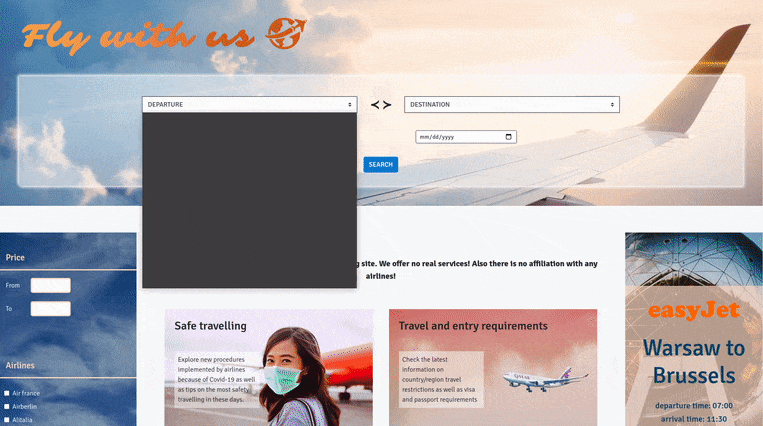
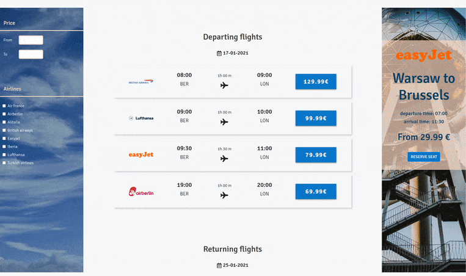
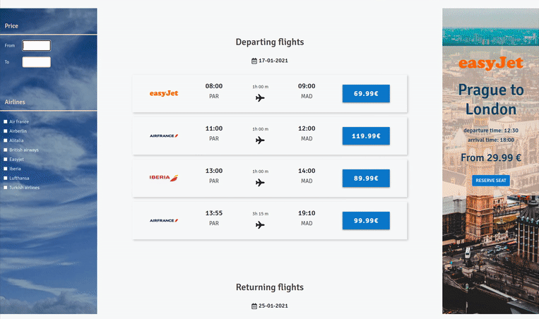
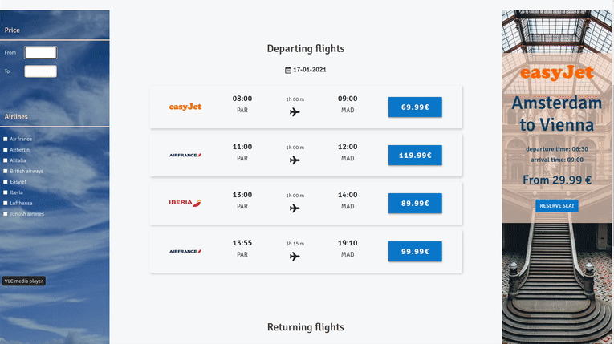
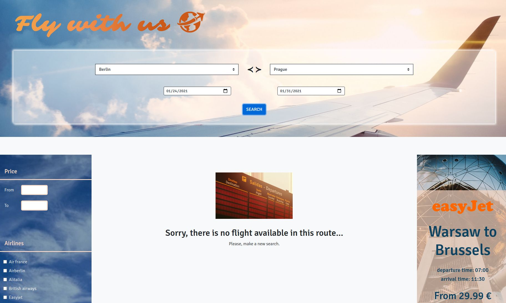
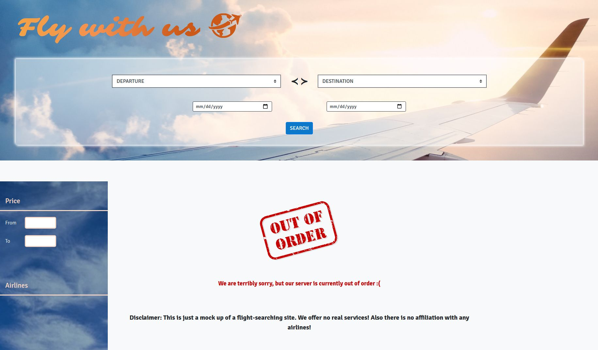
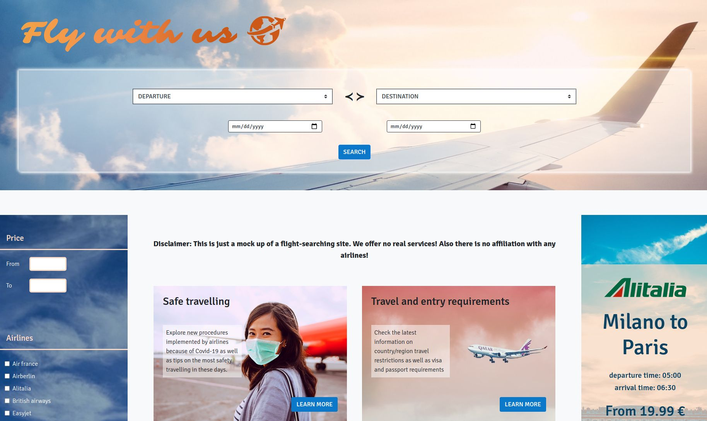
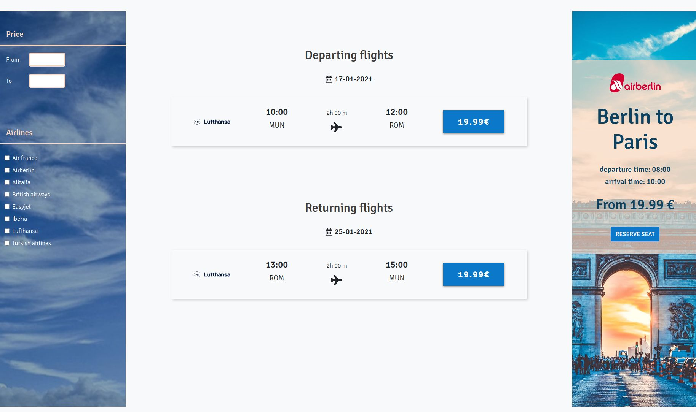
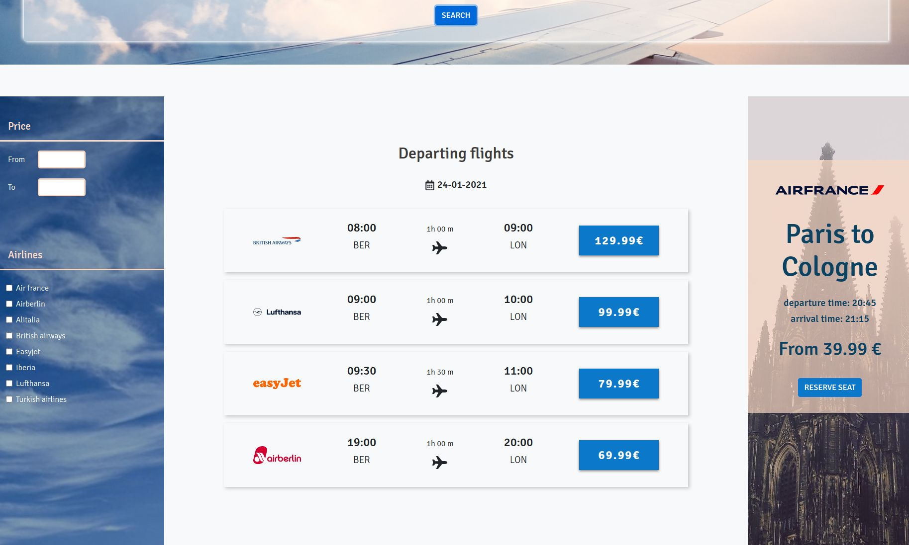

<h1> </h1>

Explore application by [Setting it up](#setup) locally or look at previews in [Gallery](#gallery)

## Description

Group fullstack mockup of the flight-search application created during database module of our one year full-stack training. Uses mySQL as a database, Express.js for backend and React.js for frontend.

**Authors:** [Alice Rez](https://github.com/Alice-Rez) (Frontend-lead, main debugging help), [Isabel Costa](https://github.com/belccarvalho) (Backend-lead), [willoid](https://github.com/willoid) (Database-lead).
All authors worked on all aspects, just the main responsiveness was divided as depicted above.

**Technologies used:** mySQL, Express.js, React.js, React Transition group, React Hooks, React Context, Create React App, Bootstrap, CSS, CSS Variables, HTML, SVG

**Packages used:** mySQL for Express, async, Axios, cors, nodemon



**Implemented Features:**

- dynamic adding cities/companies list from database to React

- city selected for departure can not be selected for destination

- database contains 3 different tables (one for flights, one for companies and one for cities) - for the search of flights, joining of the tables is used

- cors package is used in backend to manage from where can be sent request to backend

- connections shown for way to the destination and back separately

- left sidebar allows to filter results by price or company

- right sidebar showing special offers as an automatic carousel, data are get from database of flights

- if no connection is found, warning message will be shown

- if the backend do not correspond (server probably crashed), information about service being out of order is displayed

- the whole site is responsive

## Setup

1. Clone repository and go to new created directory

   **Database:**

2. If you use mySQL Shell, import database using:

   ```
   sudo mysql –u root –p dbName < <path>/flight_search.sql
   ```

   If you use XAMPP or other tools, use the way of importing database from their documentation

3. Check in terminal on which port your mySQL/XAMPP/other tool operates using this command:

   ```
    sudo lsof -i -P -n | grep LISTEN
   ```

4. If the port number is different than 3306, change `dbPort` in `backend/config.js` on value of your port:

   ```
    module.exports.dbPort = "<your-mySQL-port-nr>";
   ```

5. Add your user name (`dbUser`) and password (`dbPassword`) to mySQL databases in `backend/config.js`:

   ```
   module.exports.dbUser = "<your-mySQL-username>";
   module.exports.dbPassword = "<your-mySQL-password>";
   ```

   **Backend:**

6. Change directory to `backend` and start server by:

   ```
    nodemon start
   ```

   **Frontend:**

7. In directory `frontend`, start client side using:

   ```
    npm start
   ```

8. If your client runs at different port than default port number 3000, change `frontendPort` in `backend/config.js` on value of your port:

   ```
    module.exports.frontendPort = "<your-frontend-port-nr>";
   ```

9. Enjoy!

## Acknowledgement

Frontend of this project was bootstrapped with [Create React App](https://github.com/facebook/create-react-app).

## Gallery

**Fig.1** : Basic searching function


</br>
</br>
</br>

**Fig.2** : Filtering through the results



</br>
</br>
</br>

**Fig.3** : More filtering through results



</br>
</br>
</br>

**Fig.4** : Part of special offers carousel display



</br>
</br>
</br>

**Fig.5** : Responsiveness of the website


</br>
</br>
</br>

**Fig.6** : Warning message when no results were found



</br>
</br>
</br>

**Fig.7** : Out of Order message for case the server crashed



</br>
</br>
</br>

**Fig.8** : Landing page



</br>
</br>
</br>

**Fig.9** : End of the landing page


</br>
</br>
</br>

**Fig.10** : Displayed search results for both directions



</br>
</br>
</br>

**Fig.11** : More connection options for one direction



</br>
</br>
</br>
